# Frontend Documentation

<Note>
  Cette documentation couvre l'ensemble de notre écosystème frontend, comprenant notre application mobile React Native et notre plateforme web Next.js.
</Note>

<CardGroup>
  <Card title="Application Mobile" icon="mobile">
    React Native avec TypeScript pour une expérience native performante
  </Card>
  <Card title="Application Web" icon="browser">
    React Native en essayant de faire le portage le plus proche possible
  </Card>
  <Card title="Vitrine" icon="web-awesome">
    Next.js 15 avec TypeScript pour une plateforme web moderne
  </Card>
</CardGroup>

## 🎯 Notre Vision

Notre projet offre une expérience utilisateur cohérente à travers trois interfaces distinctes :

- Application mobile native **ergonomique** & Version web **responsive**
- Site vitrine **immersif**

```mermaid
graph LR
    A[Composants Partagés] --> B[App Mobile]
    A --> C[App Web]
    A --> D[Vitrine]
    style A fill:#e2e8f0 text:black
    style B fill:#93c5fd text:black
    style C fill:#93c5fd text:black
    style D fill:#93c5fd text:black
```



## 📱 Application Mobile

<Tabs>
  <Tab title="Technologies">
    - React Native
    - Tailwind CSS
    - Expo / Expo router
  </Tab>
  <Tab title="Features">
    - Authentication native
    - Offline first
    - Push notifications
  </Tab>
</Tabs>

### Structure

```bash
src/
├── components/
│   ├── shared/       # Composants réutilisables
│   ├── screens/      # Composants spécifiques aux écrans
│   └── ui/           # Éléments d'interface basiques
├── navigation/       # Configuration des routes
├── hooks/           # Custom hooks
├── theme/           # Configuration Tailwind
└── utils/           # Fonctions utilitaires
```

## 💻 Application Web

Version web de notre application mobile, optimisée pour une expérience desktop fluide.

### Adaptations Spécifiques

<CardGroup>
  <Card title="Navigation" icon="compass">
    Adaptation du système de navigation mobile pour le web
  </Card>
  <Card title="Responsive" icon="display">
    Design adaptatif pour tous les écrans
  </Card>
  <Card title="Interactions" icon="hand-pointer">
    Optimisation pour souris et clavier
  </Card>
</CardGroup>

## 🌐 Site Vitrine

<Tabs>
  <Tab title="Stack">
    - Next.js 15
    - Tailwind CSS
    - ShadCN / HeroUI
  </Tab>
  <Tab title="Performance">
    - Static Generation (SSG)
    - Images optimisées
    - SEO optimisé
  </Tab>
</Tabs>

### Système de rendu

<Frame>
  
</Frame>

## 🎨 Guidelines Frontend

## 📘 TypeScript

### Types Partagés

```typescript
// types/user.ts
export interface User {
  id: string;
  name: string;
  email: string;
  preferences: UserPreferences;
}

export type UserPreferences = {
  theme: 'light' | 'dark';
  notifications: boolean;
  language: string;
};
```

### Best Practices TypeScript

<CardGroup>
  <Card title="Strict Mode" icon="shield-check">
    ```json
      {
        "compilerOptions": {
        "strict": true,
        "noImplicitAny": true,
        "strictNullChecks": true
        }
      }
    ```
  </Card>
  <Card title="Type Inference" icon="wand-magic-sparkles">
    ```typescript
    // ❌ Éviter
    const user: { name: any };

    // ✅ Préférer
    const user = { name: string };
    ```
  </Card>
</CardGroup>

### Patterns React & TypeScript

```typescript jsx
// Composant avec Props typées
interface ButtonProps extends ButtonHTMLAttributes<HTMLButtonElement> {
  variant: 'primary' | 'secondary';
  isLoading?: boolean;
}

const Button: FC<ButtonProps> = ({
  variant,
  isLoading,
  children,
  ...props
}) => {
  return (
    <button
      className={`btn-${variant}`}
      disabled={isLoading}
      {...props}
    >
      {isLoading ? <Spinner /> : children}
    </button>
  );
};
```

## 🚀 Next.js SSG & Performance

### Data Fetching Patterns

<Tabs>
  <Tab title="Server Components">
    ```typescript
    // app/users/page.tsx
    async function getUsers() {
    const res = await fetch('https://api.example.com/users', {
    next: { revalidate: 3600 } // Revalidate every hour
  });

    if (!res.ok) throw new Error('Failed to fetch users');

    return res.json();
  }

    export default async function UsersPage() {
    const users = await getUsers();

    return (
    <ul>
  {users.map(user => (
    <UserCard key={user.id} user={user} />
  ))}
</ul>
);
}
```
</Tab>
<Tab title="Client Components">
  ```typescript
  'use client';

  import { useQuery } from '@tanstack/react-query';

  export default function UserProfile() {
  const { data, isLoading } = useQuery({
  queryKey: ['user'],
  queryFn: () => fetch('/api/user').then(res => res.json())
});

  if (isLoading) return <Spinner />;

  return <div>{data.name}</div>;
}
```
</Tab>
</Tabs>

### Optimisation SSR

<CardGroup>
  <Card title="Route Segments" icon="route">
    - Layouts partagés
    - Loading states
    - Error boundaries
  </Card>
  <Card title="Metadata" icon="search">
    ```typescript
    // app/layout.tsx
    export const metadata = {
    title: {
    template: '%s | MonApp',
    default: 'MonApp'
  },
    description: 'Description SEO optimisée'
  };
    ```
  </Card>
</CardGroup>

### Streaming & Suspense

```typescript
import { Suspense } from 'react';

export default function Page() {
  return (
    <div>
      <Suspense fallback={<LoadingHeader />}>
        <Header />
      </Suspense>

      <Suspense fallback={<LoadingContent />}>
        <Content />
      </Suspense>
    </div>
  );
}
```

### Image Optimization

```typescript
import Image from 'next/image';

export default function ProductImage() {
  return (
    <Image
      src="/products/item.jpg"
      alt="Product"
      width={300}
      height={200}
      placeholder="blur"
      priority={true}
      className="object-cover rounded-lg"
    />
  );
}
```

### Convention de Nommage

```typescript
// Components
components/
├── shadcn/
│   ├── button.tsx       // Bouton de ShadCN
│   ├── card.tsx        // Card de ShadCN
│   └── carousel.tsx   // Carousel de ShadCN
├── ui/
│   ├── main-button.tsx    // Bouton custom
│   ├── navbar.tsx        // Navbar custom
```

### Styles Tailwind

<Warning>
  Attention! Toujours mettre les "crochets" dans "className" <br/>
  Celà évitera les problèmes quand vous aller ajouter des variables
</Warning>

```jsx
    // ❌ Éviter
    <div className="flex items-center p-4 bg-white dark:bg-gray-800 rounded-lg shadow-md"/>

    // ✅ Faire
    <div className={"flex items-center p-4 bg-white dark:bg-gray-800 rounded-lg shadow-md"}/>
```

## 🔧 Outils de Développement

<CardGroup>
  <Card title="Au choix" icon="code">
    Préférence pour WebStorm
  </Card>
  <Card title="Prettier" icon="wand-magic-sparkles">
    Format de code automatique
  </Card>
  <Card title="ESLint" icon="shield-check">
    Règles de qualité de code
  </Card>
</CardGroup>

## 📊 Métriques de Performance


### Objectifs
- Time to Interactive < 3.5s
- First Contentful Paint < 1.8s
- Lighthouse Score > 90

## 🤝 Contribution


### Process de Review
1. Créer une feat branch ou une fix branch
2. Développer et tester
3. Créer une MR (Merge Request)
4. Obtenir 1 reviews
5. Merge après approbation


