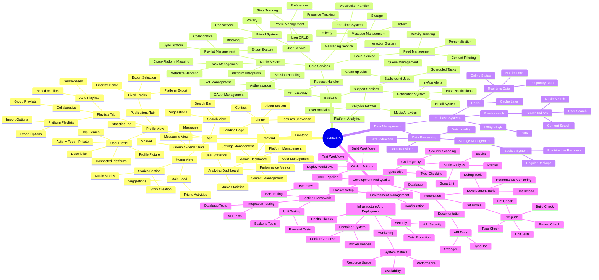

```mermaid
mindmap
	root((420MUSIK))
    	[Frontend]
        	[Frontend]
        	App
            	Profile View
                	User Profile
                    	Profile Picture
                    	Description
                    	Top Genres
                    	Connected Platforms
                    	Activity Feed - Private
                	Statistics Tab
                	Playlists Tab
                    	Platform Playlists
                        	Export Options
                        	Import Options
                    	Auto Playlists
                        	Based on Likes
                        	Genre-based
                    	Collaborative
                        	Group Playlists
                	Publications Tab
                    	Liked Tracks
                        	Filter by Genre
                        	Export Selection
                        	Platform Export
            	Home View
                	Stories Section
                    	Music Stories
                    	Story Creation
                	Main Feed
                    	Friend Activities
                    	Suggestions
            	Messaging View
                	Group / Friend Chats
                    	Messages
                    	Shared
            	Search View
                	Search Bar
                	Suggestions

        	Admin Dashboard
            	User Management
            	Content Management
            	Platform Management
            	Analytics Dashboard
                	User Statistics
                	Music Statistics
                	Performance Metrics
            	Settings Management
        	Vitrine
            	Landing Page
            	Features Showcase
            	About Section
            	Contact

    	[Backend]
        	API Gateway
            	Authentication
                	OAuth Management
                	JWT Management
                	Session Handling
            	Request Handler
        	Core Services
            	User Service
                	Profile Management
                    	User CRUD
                    	Preferences
                    	Stats Tracking
                	Friend System
                    	Connections
                    	Blocking
                    	Privacy
            	Music Service
                	Platform Integration
                	Playlist Management
                    	Sync System
                    	Export System
                    	Collaborative
                	Track Management
                    	Metadata Handling
                    	Cross-Platform Mapping
            	Social Service
                	Feed Management
                    	Activity Tracking
                    	Content Filtering
                    	Personalization
                	Interaction System
            	Messaging Service
                	Real-time System
                    	WebSocket Handler
                    	Presence Tracking
                	Message Management
                    	Storage
                    	Delivery
                    	History
        	Support Services
            	Notification System
                	Push Notifications
                	Email System
                	In-App Alerts
            	Analytics Service
                	User Analytics
                	Music Analytics
                	Platform Analytics
            	Background Jobs
                	Queue Management
                	Scheduled Tasks
                	Clean-up Jobs

    	[Data Management]
        	Database Systems
            	PostgreSQL
                	Data
            	Redis
                	Cache Layer
                	Real-time Data
                    	Online Status
                    	Notifications
                    	Temporary Data
            	Elasticsearch
                	Search Indices
                    	User Search
                    	Music Search
                    	Content Search
        	Data Processing
            	Data Extraction
            	Data Transform
            	Data Loading
            	Storage Management
                	Backup System
                    	Regular Backups
                    	Point-in-time Recovery

    	[Development And Quality]
        	CI/CD Pipeline
            	GitHub Actions
                	Build Workflows
                	Test Workflows
                	Deploy Workflows
        	Code Quality
            	Static Analysis
                	ESLint
                	SonarLint
                	Prettier
            	Type Checking
                	TypeScript
            	Security Scanning
        	Testing Framework
            	Unit Testing
                	Frontend Tests
                	Backend Tests
            	Integration Testing
                	API Tests
                	Database Tests
            	E2E Testing
                	User Flows
        	Automation
            	Git Hooks
                	Pre-push
                    	Lint Check
                    	Type Check
                    	Format Check
                    	Unit Tests
                    	Build Check
            	Documentation
                	API Docs
                    	Swagger
                    	TypeDoc
            	Development Tools
                	Hot Reload
                	Debug Tools
                	Performance Monitoring
        	Infrastructure And Deployment
            	Container System
                	Docker Images
                	Docker Compose
            	Health Checks
            	Monitoring
                	System Metrics
                    	Performance
                    	Resource Usage
                    	Availability
            	Security
                	Data Protection
                	API Security
        	Environment Management
            	Configuration
            	Docker Setup
            	Database
```

